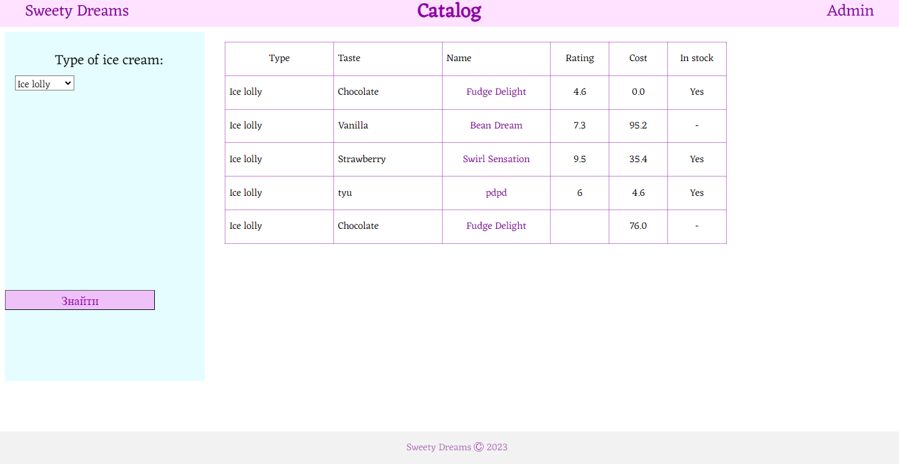
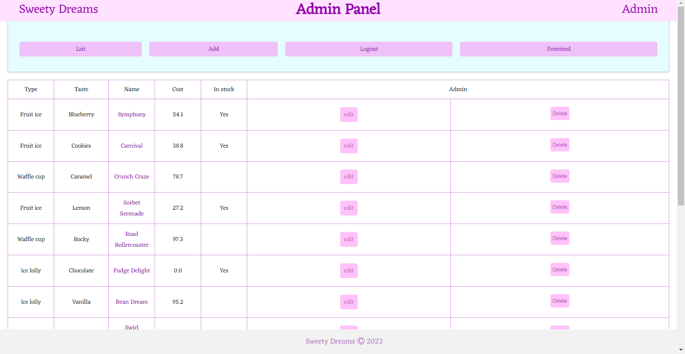
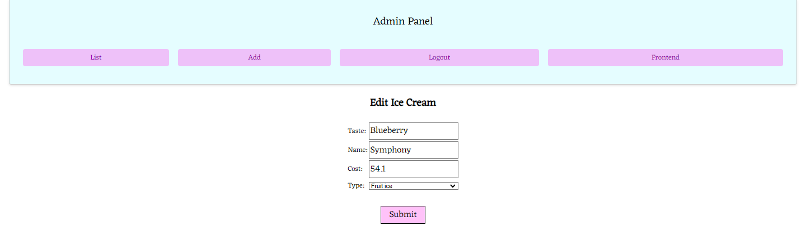

# Ice Cream Information System

Educational web application developed during the course  
**"Information Systems Design (WEB)"** in Spring 2023.

The project implements a simple information system for managing an ice cream catalog using Laravel, PHP and MySQL.

---

## Features

- Display ice cream catalog
- Filter products by type
- View product information
- Add new products
- Edit existing products
- Delete products
- Admin panel
- Database integration

---

## Technologies

- PHP 8.2
- Laravel
- MySQL
- SQL
- HTML
- CSS
- Blade Templates
- MVC architecture

---

## Database Structure

The project includes several database tables:

- `ice_creams`
- `ratings`
- `stock`
- `types`

The system supports relationships between products, ratings and stock information.

---

## Implemented Functionality

### Backend
- CRUD operations
- Routing
- Controllers
- Models
- Query Builder
- ORM operations

### Frontend
- Product catalog
- Filtering system
- Product pages
- Admin interface
- Blade templates

---

## Screenshots

### Catalog

### Admin Panel

### Product Page

---

## Educational Purpose

This project was created as part of university coursework for studying:

- MVC architecture
- Database design
- Laravel routing
- CRUD operations
- Web application structure

---

## Status

Educational archived project.
